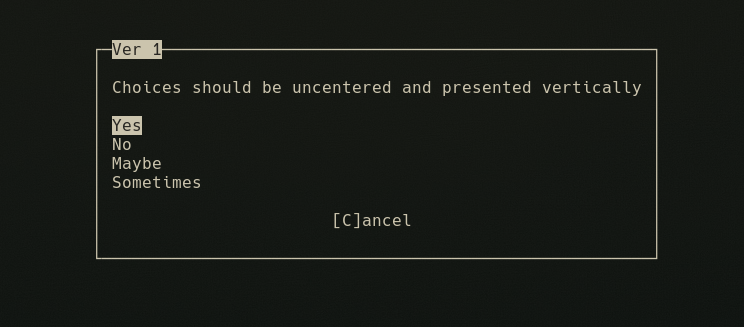

# nmenu - ncurses menu system
A 'plug and play' menu system for ncurses with automatic sizing and centering. Do it all with one function!

## Table of Contents
- [Getting started](#getting-started)
  - [Prerequisites](#prerequisites)
  - [Installing and compiling](#installing-and-compiling)
- [Running the test](#running-the-test)
- [Including nmenu in projects](#including-nmenu-in-projects)
- [Using nmenu](#using-nmenu)
  - [Parameters](#parameters)
  - [Examples](#examples)
  - [Interacting with the menu](#interacting-with-the-menu)
## Getting started
The following instructions will allow you to install nmenu locally for testing and development
### Prerequisites
The following dependencies are required to be able to compile/run nmenu:
* [ncurses](https://www.gnu.org/software/ncurses/)
* [gcc](https://gcc.gnu.org/)
### Installing and compiling
Run the following command to clone nmenu and compile it for use in your projects:
```
git clone https://github.com/joestandring/nmenu
cd nmenu
make
```
The files 'test' and 'nmenu.o' will be created.
## Running the tests
Once you have compiled nmenu, you can test to see if it is working by running 'test':
```
./test
```
You should then be shown 4 menus in succession which (hopefully) look like this:



After the last number, the values of the selected options will be output to the terminal:
```
./test
Choice 1: 2
Choice 2: 3
Choice 3: 1
Choice 4: 4
```
If these tests do not show as expected, recompile and try again. If this does not fix it, please help by reporting the bug via the Issues tab.
## Including nmenu in projects
In order to use nmenu in your ncurses project, first copy nmenu.h and nmenu.o to your project directory:
```
cp nmenu.h ~/path/to/myproject/
cp nmenu.o ~/path/to/myproject/
```
At the start of your .c file, be sure to include nmenu and ncurses:
```
#include"nmenu.h"
#include<ncurses.h>
```
When compiling your .c file with gcc, be sure to reference nmenu.o and ncurses:
```
gcc -o myproject main.c nmenu.o -lncurses
```
## Using nmenu
### Parameters
menu() takes 6 parameters:
* title - The text displayed at the top of the window. This should be short, probabaly one or two words
* description - The text displayed inside the window
* choices - An array of strings containing the choices to be displayed
* choicesSize - The number of elements in the choices array. Unfortunatley sizeof() does not work in a parameter so this must be done manually.
* vertical - If set to true, choices will be displayed vertically
* centered - If set to true, choices will be centered in the middle of the window. This might not look as good if you're not careful with the length of your choices
### Examples
```
char *choices[2] = {"Yes", "No"};

menu("Confirm", "Are you sure you want to exit?", choices, 2, true, true);
```

```
char *choices[5] = {"1 ", "2 ", "3 ", "4 ", "5 "};

menu("Amount", "Select the number of pages you want to print:", choices, 5, false, true);
```

### Interacting with the menu
To navigate choices, the up, left, right, and down arrow keys can be used. The currently highlighted choice will have a white background
To select a choice, the enter and space keys can be used. This will return the value of the selected choice
To close the menu without selecting anything, the 'c' or escape key can be used. Using escape will be slower
